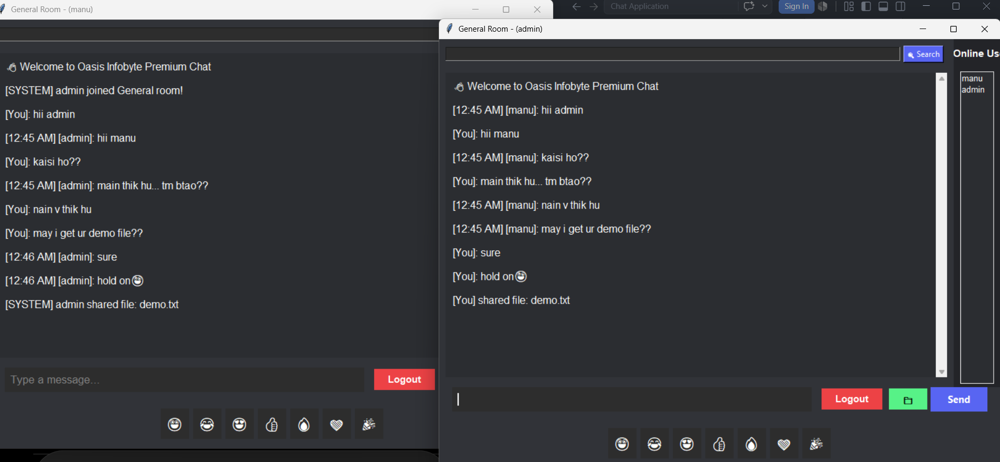
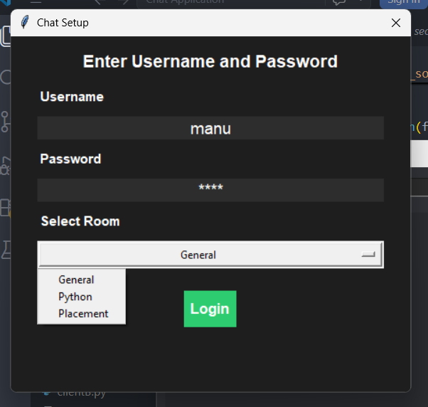
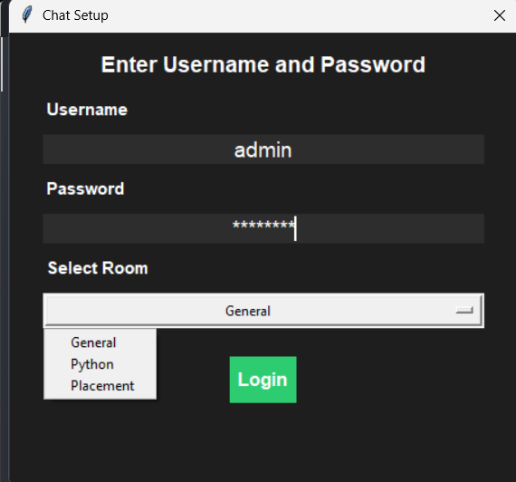
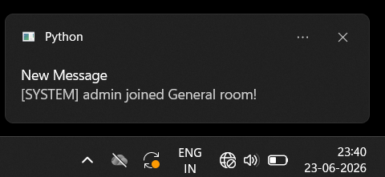
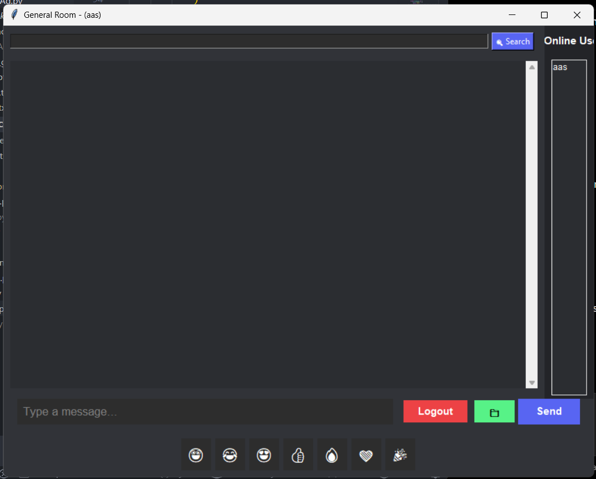
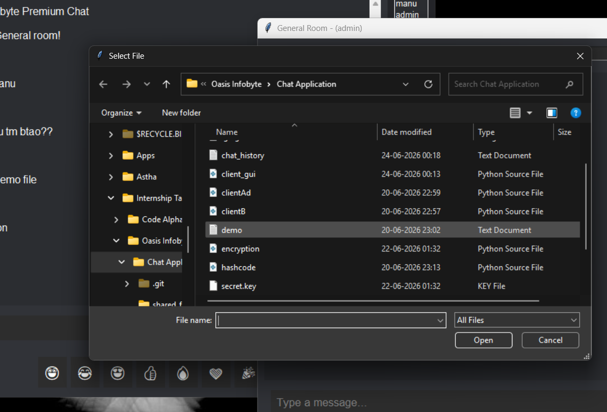
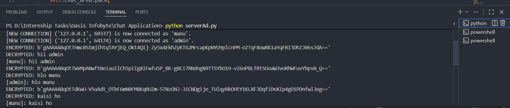

# Astha Chat Application



A secure multi-room chat application developed using Python Socket Programming and Tkinter GUI. The application supports authentication, private messaging, file sharing, online users tracking, notifications, chat history, emoji support, and encrypted communication.

## Features

* User Authentication
* Multiple Chat Rooms
* Private Messaging (DM)
* Online Users List
* File Sharing
* Desktop Notifications
* Message Search
* Emoji Support
* Chat History Storage
* Message Encryption using Fernet Cryptography

## Screenshots

### Login Screen



### Room Selection / Authentication



### Desktop Notification



### Main Chat Interface


### Chat Area



### File Sharing



### Encryption & Decryption



## Technologies Used

* Python 3
* Tkinter
* Socket Programming
* Cryptography (Fernet)
* Plyer Notifications

## Project Structure

```text
Chat Application/
│
├── client_gui.py
├── serverAd.py
├── users.txt
├── secret.key
├── chat_history.txt
├── shared_files/
├── screenshots/
└── README.md
```

## How to Run

### Start Server

```bash
python serverAd.py
```

### Start Client

```bash
python client_gui.py
```

## Key Features Demonstrated

* Real-time communication between multiple users
* Secure encrypted messaging using Fernet Encryption
* Online user tracking
* Room-based chatting
* File sharing support
* Desktop notifications
* Chat history storage and search functionality
* Modern Tkinter graphical user interface

## Author

**Astha Kumari**
